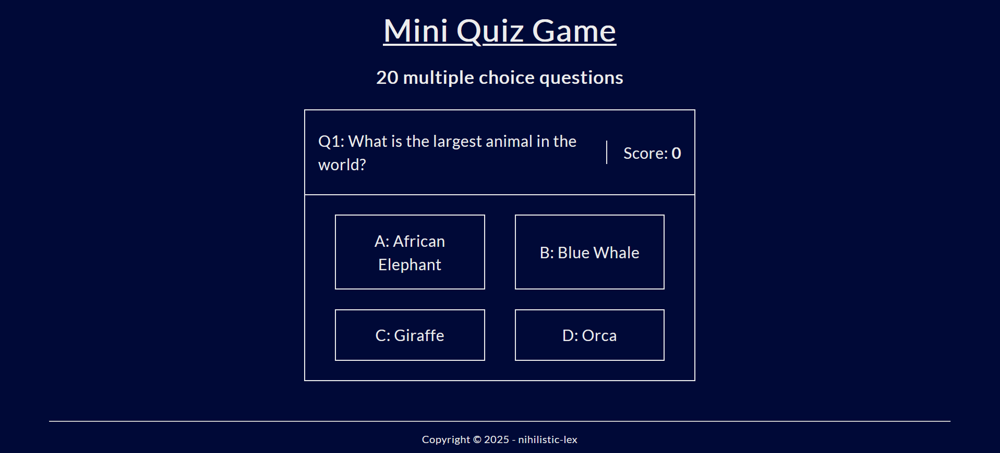

# 20-Question Quiz Game

Test your general knowledge with this 20-question quiz game.
How did you do?

A browser-based quiz game built with HTML, CSS, and JavaScript.

This is my fourth solo project.

## Features

- A 'Begin Game' button to start the quiz
- The first question appears with four multiple-choice options after starting
- Selecting an option hides all choices, and the right answer is displayed (green if correct, red if incorrect) along with a 'Next Question' button; score increments if correct
- Final score out of 20 is displayed at the end

## Preview

---

Created by [`<lexiCodes/>`](https://github.com/nihilistic-lex)